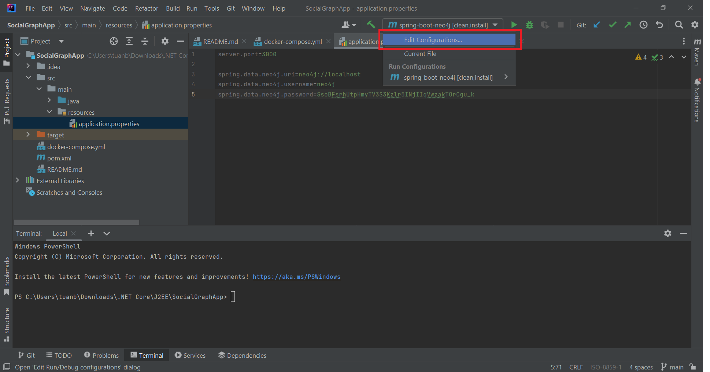
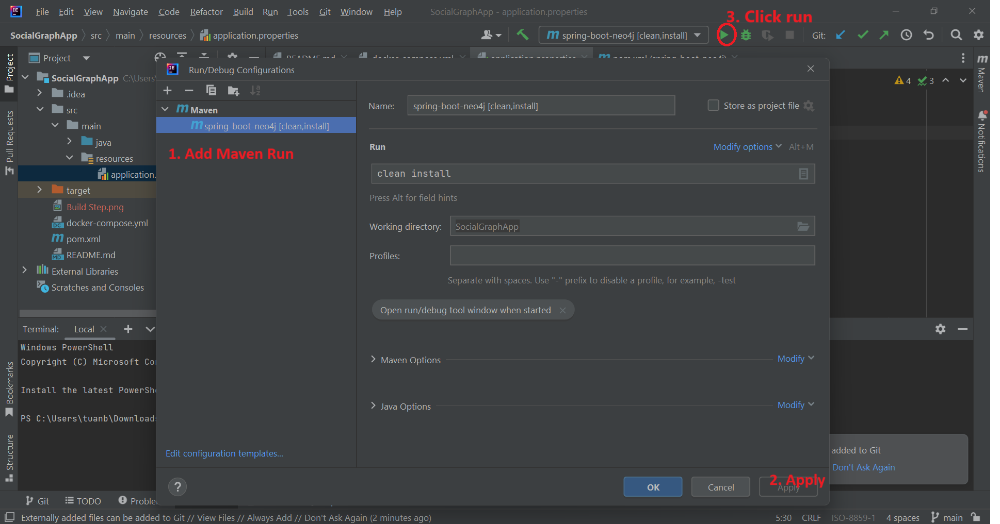
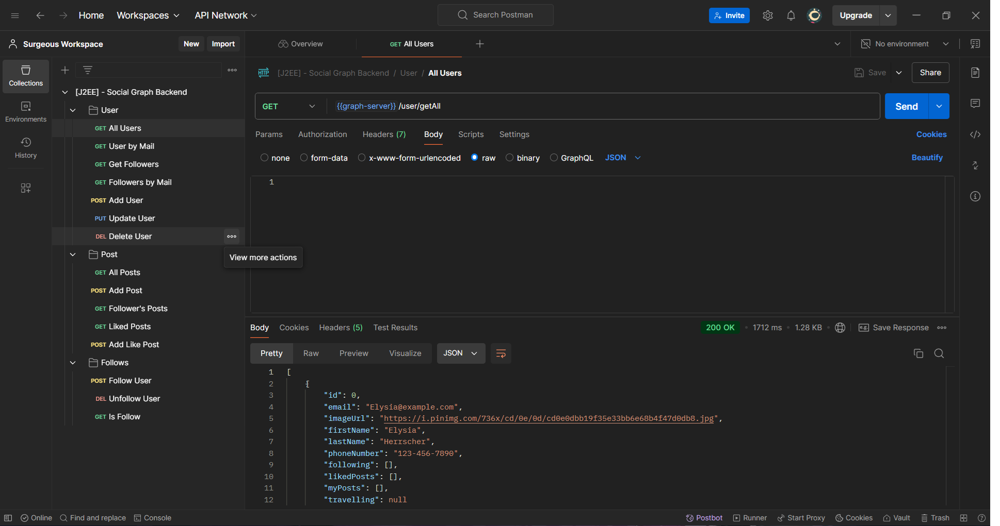

# Social Graph App

A Social Graph backend based on Neo4j graph database & Java Spring

## Features
- Create users, posts
- Allow users to follow other users, like their posts

## Installation
1. Install IntelliJ through their homepage [link](https://www.jetbrains.com/help/idea/getting-started.html) and Docker Desktop at [link](https://www.docker.com/products/docker-desktop/)
2. Clone the repository
 `[git clone https://github.com/SurgeousJP/SocialGraphApp]`
3. Open the project directory using terminal and run docker-compose up -d to build the neo4j database container and run it
4. Open the neo4j browser at http://localhost:7474/browser (please wait a bit for docker-compose up -d to run since it takes some time)
5. Login the neo4j browser using the username and password (neo4j - SsoBFsrhUtpHmyTV3S3Kzlr5INjIIqVwzakTOrCgu_k)
6. Create maven build clean configuration illustrated below:

  
  

7. Run the Spring backend server using the command: java -jar target/spring-boot-neo4j-0.0.1-SNAPSHOT.jar (or the jar file name generated in the target folder)
8. Test the API using Postman (import Postman using Postman file in the repo) 

## Note
Please note that upon the first time run the data is empty (due to the database is local), please create your own data for testing using the APIs
